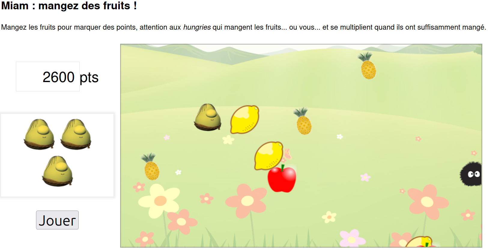

# 🍓 Miam: Eat the Fruits!

**Miam** is a fun little JavaScript game where your character (the Greedy) must eat as many fruits as possible while avoiding dangerous enemies (the Hungries). The game is built using pure JavaScript and HTML5 Canvas.

  
*Eat the fruits, avoid the Hungries!*

## 📝 Description

In this arcade-style game, the player controls a character that moves across the canvas to collect fruits for points. Meanwhile, Hungries also roam the field looking for fruits to eat—and if they eat enough, they multiply! The challenge is to score as many points as possible before losing all your lives.

---

## 🚀 Features

-  Randomly spawning fruits (e.g., pineapple, apple, lemon)
-  Smart enemies (Hungries) that chase and multiply after eating enough fruits
-  Arrow key movement via a custom key manager
-  Canvas auto-clearing and redrawing for smooth animations
-  Live score tracking
-  Life system with heart icons
-  Start and stop game with a button

## 🧠 Object-Oriented Programming (OOP)

This project uses **object-oriented programming** (OOP) principles to structure the game logic. Key concepts applied include:

- **Encapsulation**: Game elements like the player, fruits, and enemies are represented by classes with specific properties and methods.
- **Inheritance**: A `MobileObject` class extends from a generic `GameObject` class, allowing shared logic for positioning, while adding motion-specific behavior.
- **Modularity**: Each object type (Greedy, Fruit, Hungry) is separated into its own module/file, making the code more maintainable and scalable.
- **Reusability**: By using inheritance and method overriding, common behaviors are reused and extended where necessary.

---

## 🧰 Technologies Used

- HTML5 / CSS3
- JavaScript 
- HTML Canvas API

---
